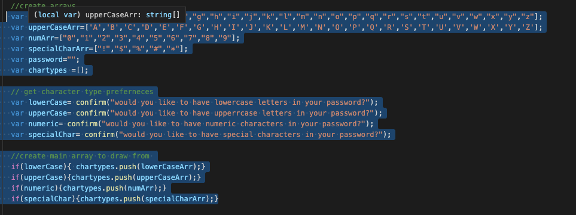

# Password-Generator
This project takes input from the user and then creates and displays a password. Character styling is taken in from the user creating an array of possible characters that get randomly selected to create a password thats length is user choice.
This scrrenshot shows how various arrays are concatonated depending on user choice:
